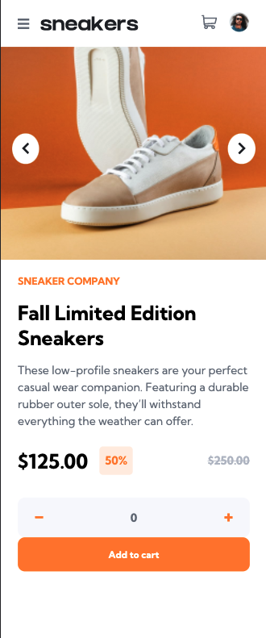

# E-commerce product page

It´s a responsive e-commerce website.

### Links

- Live Site: [E-commerce website](https://viviantang92.github.io/ecommerce-product-page/)
- Solution: [Code](https://github.com/viviantang92/ecommerce-product-page/tree/main/src)

### Screenshot

### Built with

- [React](https://reactjs.org/) - JS library
- Mobile-first workflow
- Semantic HTML5 markup
- Flexbox
- Module CSS
- Context

## Author

- Frontend Mentor - [viviantang92](https://www.frontendmentor.io/profile/viviantang92)

### Ack
### Frontend Mentor - E-commerce product page

This is a solution to the [E-commerce product page challenge on Frontend Mentor](https://www.frontendmentor.io/challenges/ecommerce-product-page-UPsZ9MJp6).